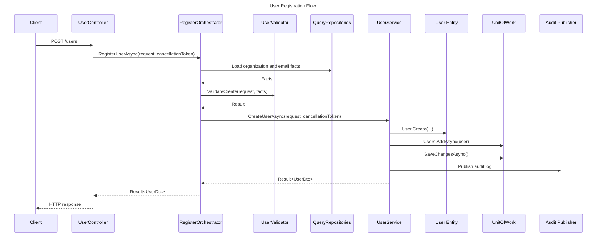

# Folder Structure

This document explains how the repository is organized.

The project uses **modular Clean Architecture**.

That means:
- The system is split into modules.
- Each module owns one business area.
- Each module is split into layers.
- Dependencies should point toward the business rules, not away from them.

IAM is used as the main example here. The same structure should be used for new modules.

---

## 1. Core Concepts

| Concept | Description |
| :--- | :--- |
| **Module** | A self-contained business area, like IAM or Sentinel. |
| **Layer** | A project inside a module with a specific responsibility. |
| **Domain** | The innermost layer. Contains entities, rules, DTOs, and contracts. |
| **Application** | Use cases. Coordinates validation, repositories, entities, and unit of work. |
| **Infrastructure** | Framework and external details, like EF Core, repositories, Redis, and migrations. |
| **API** | HTTP entry point. Controllers, middleware, authentication, authorization, and startup. |
| **Shared** | Common building blocks used by more than one module. |
| **Seeder** | Console project that creates default startup data. |

Simple mental model:

```text
API receives request
Application coordinates the use case
Domain protects business rules
Infrastructure talks to external systems
```

---

## 2. Root Structure

```text
src/
  00.Core/
  01.Shared/
  02.Sentinel/
  03.IAM/
  04.Courier/
  99.Seeder/
tests/
docs/
infra/
```

| Folder | Purpose |
| :--- | :--- |
| `src` | Application source code. |
| `tests` | Automated tests. |
| `docs` | Project documentation. |
| `infra` | Docker, scripts, and local infrastructure files. |

The numeric prefix keeps modules ordered in the file tree, it does not replace dependency rules.

---

## 3. Current Modules

| Module | Purpose |
| :--- | :--- |
| `00.Core` | Main API host for modular monolith deployment. |
| `01.Shared` | Common contracts, base classes, infrastructure helpers, parameters, cache, and messaging. |
| `02.Sentinel` | Logging and monitoring module. Stores audit logs and system logs. |
| `03.IAM` | Identity and access management module. Users, organizations, roles, permissions, and authentication. |
| `04.Courier` | Communication and notification module. Stores and sends email messages. |
| `99.Seeder` | Console app that creates default database data. |

New business modules should follow the same pattern as IAM and Sentinel.

---

## 4. Core API Host

Core API is the main modular monolith host.

It lives in:

```text
src/00.Core/
  Core.API/
```

Core API loads module API controllers through Application Parts.

It does not copy controllers.

It should not contain business rules.

It can reference module API projects:

```text
Core.API -> IAM.API
Core.API -> Sentinel.API
Core.API -> Courier.API
```

Business modules should not reference Core API.

See:
- `docs/00.core.md`
- `docs/deployment-modes.md`

---

## 5. Standard Module Shape

A normal module has four projects:

```text
Module.API/
Module.Application/
Module.Domain/
Module.Infrastructure/
```

IAM example:

```text
src/03.IAM/
  IAM.API/
  IAM.Application/
  IAM.Domain/
  IAM.Infrastructure/
```

Sentinel example:

```text
src/02.Sentinel/
  Sentinel.API/
  Sentinel.Application/
  Sentinel.Domain/
  Sentinel.Infrastructure/
```

The names change.

The responsibilities stay the same.

---

## 6. Dependency Direction

Clean Architecture is mostly about dependency direction.

The inner layers should not know the outer layers.

Allowed idea:

```text
API -> Application -> Domain
Infrastructure -> Application/Domain
API -> Infrastructure
```

Not allowed idea:

```text
Domain -> Infrastructure
Domain -> API
Application -> API
```

Why:
- Domain rules should not depend on web, database, Redis, or Docker.
- Application logic should be testable without real infrastructure.
- Infrastructure can be replaced without rewriting business rules.

---

## 7. API Project

The API project is the HTTP entry point.

Example:

```text
IAM.API/
  Configure/
  Controllers/
  Middlewares/
  Program.cs
  appsettings.json
  appsettings.Development.json
```

Responsibilities:
- Define HTTP endpoints.
- Read route, body, query, and user claims.
- Register dependency injection.
- Configure authentication.
- Configure authorization.
- Register global exception handling.
- Start the ASP.NET Core app.

Each standalone module API should also expose a reusable module registration method.

Core API uses that same method.

Example:

```csharp
builder.Services.AddIamModule(builder.Configuration);
```

Controllers should be thin.

They should:
- Receive request DTOs.
- Pass `CancellationToken`.
- Call application services or orchestrators.
- Convert `Result` to HTTP responses.

They should not:
- Access `DbContext`.
- Contain business rules.
- Build queries manually.
- Publish audit events for service-owned actions.

Good controller mindset:

```text
HTTP in -> Application call -> HTTP out
```

---

## 8. Application Project

The Application project contains use cases.

Example:

```text
IAM.Application/
  Contracts/
  Services/
  Orchestrators/
  Validators/
```

Responsibilities:
- Coordinate business operations.
- Call repositories.
- Call domain entity methods.
- Run validators.
- Use unit of work.
- Publish audit logs after successful actions.
- Return `Result` for business failures.

Services usually manage one domain area.

Examples:
- `UserService`
- `RoleService`
- `PermissionService`
- `OrganizationService`

Orchestrators coordinate multiple areas.

Example:
- `RegisterOrchestrator`

Use an orchestrator when one use case touches multiple services or multiple aggregate areas.

Example:

```text
Register organization
  -> validate organization
  -> create organization
  -> create admin user
  -> assign role
```

That is more than one simple service action.

---

## 9. Domain Project

The Domain project contains the business model.

Example:

```text
IAM.Domain/
  DTOs/
  Entities/
  Enums/
  Interfaces/
  Mappers/
  QueryRepositories/
  Repositories/
  IamConst.cs
  IamPermission.cs
```

Responsibilities:
- Entities.
- Domain behavior.
- DTOs.
- Enums.
- Constants.
- Repository interfaces.
- Query repository interfaces.
- Pure mappers.
- Permission constants.

Domain should be clean.

Domain should not:
- Use EF Core.
- Use Redis.
- Use HTTP context.
- Use application services.
- Depend on infrastructure.
- Publish events.

Example domain behavior:

```text
User.RegisterLastSuccessfullyLogin()
User.UpdatePassword(...)
Role.Update(...)
```

Business state changes should live in entities when possible.

---

## 10. Infrastructure Project

The Infrastructure project contains external details.

Example:

```text
IAM.Infrastructure/
  Configurations/
  Migrations/
  QueryRepositories/
  Repositories/
  UoW/
  IamDbContext.cs
```

Responsibilities:
- EF Core `DbContext`.
- EF Core entity configurations.
- Migrations.
- Repository implementations.
- Query repository implementations.
- Unit of work implementation.
- External provider implementations.

Infrastructure implements interfaces defined by Domain or Application.

Example:

```text
IAM.Domain.Repositories.IUserRepository
  -> IAM.Infrastructure.Repositories.UserRepository
```

Application uses the interface.

Infrastructure provides the implementation.

---

## 11. Shared Module

Shared contains reusable code used by more than one module.

Example:

```text
src/01.Shared/
  Shared.API/
  Shared.Application/
  Shared.Domain/
  Shared.Infrastructure/
```

Shared examples:
- Base entities.
- Base repository interfaces.
- Base repository implementation.
- Base service.
- User context abstraction.
- Parameter service.
- Redis publisher.
- Redis cache implementations.
- Exception handling base pieces.
- Shared constants.

Rule:

Shared must stay generic.

Do not put IAM-specific business rules in Shared.

Good Shared code:

```text
IUserContext
IEventPublisher
BaseRepository
ParameterService
```

Bad Shared code:

```text
UserService
RoleService
IamPermission
Organization business rules
```

---

## 12. Seeder Project

The seeder is separate from IAM.

Location:

```text
src/99.Seeder/DatabaseSeeder
```

Purpose:
- Create default permissions.
- Create default roles.
- Create role-permission links.
- Create default parameters.
- Create default organizations.

Why separate:
- IAM should not execute its own startup data creation.
- Seed data is infrastructure/startup concern.
- The seeder can consume IAM repositories without putting seeding logic inside IAM.

See:
- `99.database.seeder.md`

---

## 13. Tests

Tests mirror the source structure.

Example:

```text
tests/03.IAM/
  IAM.API.Tests/
  IAM.Application.Tests/
```

Core API tests live in:

```text
tests/00.Core/Core.API.Tests
```

Common ownership:

| Test project | What belongs there |
| :--- | :--- |
| `*.Application.Tests` | Services, orchestrators, validators, application behavior. |
| `*.API.Tests` | Middleware, filters, controller-specific behavior, auth wiring. |
| `*.Infrastructure.Tests` | Redis, cache, repositories, background services, integration-like behavior. |

Rules:
- Put service logic tests in Application tests.
- Put API-only behavior in API tests.
- Put Shared behavior in Shared tests.
- Do not add cross-layer test references without checking ownership.

---

## 14. Request Flow Example

Example: create a user.

High-level flow:

```text
UserController
  -> RegisterOrchestrator
    -> Query repositories gather facts
    -> Validator checks request and facts
    -> UserService creates user
    -> User entity applies domain rules
    -> Repository tracks new entity
    -> UnitOfWork saves
    -> Audit log is published
  -> UserController returns HTTP response
```

The controller does not decide business rules.

The validator does not query the database.

The entity does not save itself.

The repository does not publish logs.

Each class has one job.

---

## 15. Sequence Example



This diagram shows responsibility boundaries.

It is not meant to show every line of code.

---

## 16. Where To Put New Code

Use this quick guide.

| New code | Put it in |
| :--- | :--- |
| New HTTP endpoint | API controller. |
| New host-level endpoint | Core API only when it is truly host-level, like Core health. |
| New request validation | Application validator. |
| New business action | Application service or orchestrator. |
| Entity state change | Domain entity method. |
| EF query returning entity | Infrastructure repository. |
| Read-only DTO query | Infrastructure query repository. |
| New permission code | Domain permission constants and seeder. |
| New shared abstraction | Shared Domain or Shared Application. |
| New Redis implementation | Shared Infrastructure or module Infrastructure. |
| New default data | Seeder project. |

When unsure, ask before adding files.

---

## 17. Rules

- Keep controllers thin.
- Keep domain independent.
- Keep Core API as a host only.
- Do not copy module controllers into Core API.
- Use repositories through interfaces.
- Use query repositories for DTO reads.
- Use unit of work for saving.
- Keep seed execution outside business modules.
- Keep Shared generic.
- Add tests in the layer that owns the behavior.
